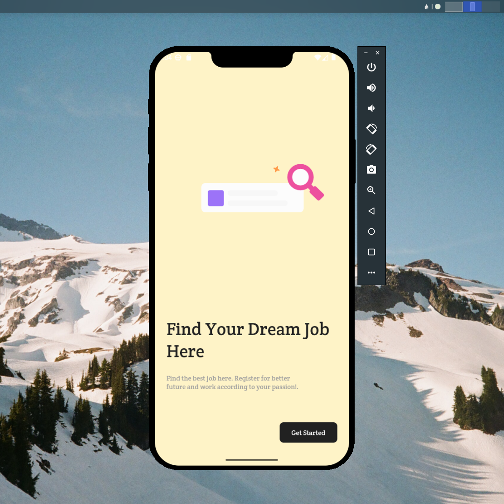

## Flutter UI - Job Landing

```dart
void main() => runApp(MaterialApp(
    theme: ThemeData(fontFamily: 'Crete'),
    debugShowCheckedModeBanner: false,
    initialRoute: '/',
    onGenerateRoute: (settings) {
      if (settings.name == '/') {
        return RouteAnimation.slide(settings, LandingPage());
      }
      return RouteAnimation.slide(settings, LandingPage());
    }));
```

## Development Setup
```
git clone https://github.com/afifcodes/flutter-job-landing.git
cd flutter-job-landing
flutter pub get
flutter run
```

## Screenshots


## Links

* [Website](https://afifcodes.vercel.app)
* [Youtube channel](https://youtube.com/afifcodes)
* [Instagram](https://instagram.com/afifcodes)
